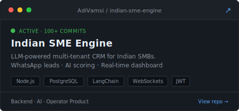
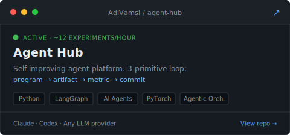

<div align="center">


</div>

<br/>

AI engineer building **production LLM systems, agent platforms, and the Python backends that hold them up** — software designed to eliminate manual work, not to win demos.

Currently at DATARA (May 2025–present) shipping async Python services and LLM classification pipelines — **99.9% uptime, 35% reduction in manual data extraction** across core workflows. Side builds: a grounded RAG service for insurance claim adjudication, an LLM-powered CRM for Indian SMBs, and a self-improving agent research platform.

---

## What I Build

**AI Workflows & LLM Pipelines** — Production LLM API integration, prompt-engineered classification, RAG systems, and agentic orchestration. Built to eliminate manual work from core business processes, not to pass benchmarks.

**Agent Systems** — Self-improving platforms where agents run optimization loops autonomously: program → artifact → metric → commit. Multi-agent coordination with pluggable LLM providers.

**Async Backend Services** — Python and Java/Spring Boot services behind the AI layer. Clean API contracts, observable, debuggable under real load.

**Operator Products** — CRMs, lead engines, and real-time dashboards for operators running daily workflows. WhatsApp capture, AI scoring, live updates over WebSockets.

---

## Systems

### [→ Insurance Claims RAG](https://github.com/AdiVamsi/insurance-claim-rag) &nbsp; <sub>`latest`</sub>

A grounded retrieval service for insurance claim adjudication. Every answer is backed by a verbatim policy clause and a JSON audit trail an adjuster can hand to compliance. When the corpus doesn't support an answer, the service **refuses instead of guessing** — the output is structured JSON, not chat.

```
POST /ask → classify → retrieve → ground → verify → ClaimAnswer JSON
                │          │         │         │
                ▼ low conf ▼ low sim │         ▼ quote not in context
                └──────────────── refuse ──────┘
```

Each request runs a **LangGraph** state machine with three independent refusal gates (classifier confidence, retrieval similarity, verifier quote-match). The gate that tripped is recorded in `audit_trail` — every decision is reviewable. Ingest: PDFs → pypdf per-page → heading-aware split → MiniLM embeddings → ChromaDB filtered by `policy_type`. FastAPI, Python 3.11, ~2 minutes from clone to first response.

&nbsp;

<table>
<tr>
<td width="50%">
<a href="https://github.com/AdiVamsi/indian-sme-engine">

</a>
</td>
<td width="50%">
<a href="https://github.com/AdiVamsi/agent-hub">

</a>
</td>
</tr>
</table>

**Indian SME Engine** — LLM-powered multi-tenant CRM for Indian SMBs. Captures leads from web forms and WhatsApp, auto-classifies and scores them via AI, surfaces prioritized follow-ups through a real-time operator dashboard. Node.js/Express + Prisma/PostgreSQL, JWT auth with tenant-isolated data layer, WebSocket live updates, AI scoring engine. **100+ commits, actively developed.**

**Agent Hub** — Self-improving agent platform running **~12 experiments/hr** via an automated loop: `program.md → artifact → scalar metric → git commit or reset`. Meta-agent coordination layer for hands-off overnight optimization with clean version history — pluggable into Claude, Codex, or any LLM provider.

---

## Now Building

```
role:     Python Developer @ DATARA Pvt Ltd  ·  San Antonio, TX / Remote
focus:    LLM pipeline automation + async Python backend services
shipped:  5 production data pipelines · async I/O cut turnaround 10h → 8h
          Modular integration layer onboarded 3 new sources in <2 wks each
          LLM classification stages removed 35% of manual data extraction
          (~150 analyst-hrs/mo recovered) · 99.9% uptime across envs
ops:      Structured debug + logging cut incident resolution 48h → 12h
latest:   insurance-claim-rag — grounded RAG w/ refusal gates & audit trail
stack:    Python · FastAPI · LangChain · LangGraph · ChromaDB · PostgreSQL
```

---

## Stack

**Core** &nbsp;


**AI & Agents** &nbsp;


**Backend & Infra** &nbsp;


**Certified** &nbsp;


---

## 3 AM · You're On Call



```
[03:14:22]  PagerDuty: prod-api p99 latency 8400ms · error_rate 67% · db_pool EXHAUSTED
[03:14:23]  You:       $ ssh prod-api-01
```

**Three decisions. No hints. Expand a choice to see what happens.**

<details>
<summary><b>Decision 1 —</b> First move?</summary>

&nbsp;

<details>
<summary>&nbsp;&nbsp;→ <code>kubectl rollout restart</code> the API pods</summary>

&nbsp;&nbsp;&nbsp;&nbsp;❌ Connections drain, pool recovers for 40 seconds, then saturates again. You bought time, not a fix. **Pager fires again at 03:19.**

</details>

<details>
<summary>&nbsp;&nbsp;→ Open the DB: <code>SELECT state, count(*) FROM pg_stat_activity GROUP BY 1</code></summary>

&nbsp;&nbsp;&nbsp;&nbsp;✅ 198 of 200 connections stuck in `idle in transaction`. Something opened transactions and never committed. Go to **Decision 2**.

</details>

<details>
<summary>&nbsp;&nbsp;→ Scale the pods 3x and go back to bed</summary>

&nbsp;&nbsp;&nbsp;&nbsp;❌ More pods = more connection pool clients = DB dies harder. **You just DoSed your own database.**

</details>

</details>

<details>
<summary><b>Decision 2 —</b> 198 idle-in-transaction connections. Where's the bug?</summary>

&nbsp;

<details>
<summary>&nbsp;&nbsp;→ Kill the idle connections: <code>pg_terminate_backend(...)</code></summary>

&nbsp;&nbsp;&nbsp;&nbsp;⚠️ Service recovers. But you didn't find the bug. It'll page you again tomorrow. **Right answer, wrong altitude.**

</details>

<details>
<summary>&nbsp;&nbsp;→ Grep the last deploy for <code>BEGIN</code> / <code>session.begin()</code> without matching <code>commit</code> or <code>with</code>-block</summary>

&nbsp;&nbsp;&nbsp;&nbsp;✅ New background worker opened a session on startup and reused it across tasks. An exception in one task left the transaction open — permanently. Go to **Decision 3**.

</details>

<details>
<summary>&nbsp;&nbsp;→ Raise the connection pool size</summary>

&nbsp;&nbsp;&nbsp;&nbsp;❌ Leaks don't care about pool size. You'll hit the ceiling again, just later. **The leak still runs.**

</details>

</details>

<details>
<summary><b>Decision 3 —</b> The fix?</summary>

&nbsp;

<details>
<summary>&nbsp;&nbsp;→ Wrap every worker task in a scoped session + context manager; add a connection-age alert</summary>

&nbsp;&nbsp;&nbsp;&nbsp;✅ Session lifecycle is now bounded by the task, not the process. The alert catches it in staging next time. **Incident closed, bug killed at the root, guardrail in place so the next deploy can't do this again.**

</details>

<details>
<summary>&nbsp;&nbsp;→ Add a cron to kill idle-in-transaction connections older than 5 minutes</summary>

&nbsp;&nbsp;&nbsp;&nbsp;⚠️ You papered over the leak instead of fixing it. A future engineer will hit the exact same 3 AM page, and your cron will hide the signal.

</details>

<details>
<summary>&nbsp;&nbsp;→ Revert the deploy and write a postmortem</summary>

&nbsp;&nbsp;&nbsp;&nbsp;⚠️ Stops the bleeding, but the worker pattern is now tribal knowledge — not a guardrail. **Half credit.**

</details>

</details>

&nbsp;

<sub>The system works. Go to sleep.<br/>— <i>The kind of problem I think about every day. Every path above is a real pattern I've either shipped a fix for or inherited.</i></sub>

---

## Activity

<div align="center">


</div>

---

## Find Me

[](mailto:adivamsi1998@gmail.com)
&nbsp;
[](https://www.linkedin.com/in/adi-vamsi-sai-326667128/)
&nbsp;
[](https://portfolio-orpin-rho-13.vercel.app)
&nbsp;
[](https://portfolio-orpin-rho-13.vercel.app/resume.pdf)
&nbsp;
[](https://github.com/AdiVamsi)

<br/>


