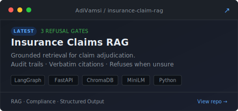
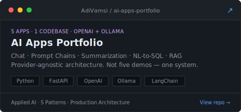

<div align="center">


</div>

<br/>

AI engineer building **production LLM systems, agent platforms, and the Python backends that hold them up** — software designed to eliminate manual work, not to win demos.

Currently at DATARA (May 2025–present) shipping async Python services and LLM classification pipelines — **99.9% uptime, 35% reduction in manual data extraction** across core workflows. Side builds: a grounded RAG service for insurance claim adjudication, a portfolio of 5 applied AI apps, an LLM-powered CRM for Indian SMBs, and a self-improving agent research platform.

---

## What I Build

**AI Workflows & LLM Pipelines** — Production LLM API integration, prompt-engineered classification, RAG systems, and agentic orchestration. Built to eliminate manual work from core business processes, not to pass benchmarks.

**Agent Systems** — Self-improving platforms where agents run optimization loops autonomously: program → artifact → metric → commit. Multi-agent coordination with pluggable LLM providers.

**Async Backend Services** — Python and Java/Spring Boot services behind the AI layer. Clean API contracts, observable, debuggable under real load.

**Operator Products** — CRMs, lead engines, and real-time dashboards for operators running daily workflows. WhatsApp capture, AI scoring, live updates over WebSockets.

---

## Systems

<table>
<tr>
<td width="50%">
<a href="https://github.com/AdiVamsi/insurance-claim-rag">

</a>
</td>
<td width="50%">
<a href="https://github.com/AdiVamsi/ai-apps-portfolio">

</a>
</td>
</tr>
<tr>
<td width="50%">
<a href="https://github.com/AdiVamsi/indian-sme-engine">

</a>
</td>
<td width="50%">
<a href="https://github.com/AdiVamsi/agent-hub">

</a>
</td>
</tr>
</table>

<details>
<summary><b>Insurance Claims RAG</b> — Grounded retrieval for claim adjudication &nbsp; <sub><code>latest</code></sub></summary>

&nbsp;

Every answer is backed by a verbatim policy clause and a JSON audit trail an adjuster can hand to compliance. When the corpus doesn't support an answer, the service **refuses instead of guessing**.

```
POST /ask → classify → retrieve → ground → verify → ClaimAnswer JSON
                │          │         │         │
                ▼ low conf ▼ low sim │         ▼ quote not in context
                └──────────────── refuse ──────┘
```

LangGraph state machine with **3 independent refusal gates** (classifier confidence, retrieval similarity, verifier quote-match). Ingest: PDFs → pypdf per-page → heading-aware split → MiniLM embeddings → ChromaDB filtered by `policy_type`. FastAPI, Python 3.11, ~2 minutes from clone to first response.

</details>

<details>
<summary><b>AI Apps Portfolio</b> — 5 applied AI patterns in one structured codebase</summary>

&nbsp;

Chat · Prompt Chaining · Content Summarization · Natural-Language-to-SQL · Multi-Document RAG — all built on a shared, **provider-agnostic** foundation that works with both OpenAI and local Ollama models. Not five random demos — one system with consistent architecture, shared utilities, clean UIs, and honest limitations.

</details>

<details>
<summary><b>Indian SME Engine</b> — LLM-powered multi-tenant CRM for Indian SMBs</summary>

&nbsp;

Captures leads from web forms and WhatsApp, auto-classifies and scores them via AI, surfaces prioritized follow-ups through a real-time operator dashboard. Node.js/Express + Prisma/PostgreSQL, JWT auth with tenant-isolated data layer, WebSocket live updates, AI scoring engine. **100+ commits, actively developed.**

</details>

<details>
<summary><b>Agent Hub</b> — Self-improving agent platform</summary>

&nbsp;

Each agent optimizes a real-world problem overnight via an automated loop: `program.md → artifact → scalar metric → git commit or reset`. Running **~12 experiments/hr**. Meta-agent coordination layer for hands-off overnight optimization with clean version history — pluggable into Claude, Codex, or any LLM provider.

</details>

---

## Proof of Work

Numbers from production, not a portfolio site.

```
┌─────────────────────────────────────────────────────────────────┐
│  DATARA · Python Developer · May 2025–present                   │
├─────────────────────────────────────────────────────────────────┤
│  5 production pipelines  │  99.9% uptime  │  35% less manual    │
│  async I/O: 10h → 8h    │  3 new sources │  150 hrs/mo saved   │
│  incidents: 48h → 12h   │  in <2 wks each │  post-deploy -15%  │
├─────────────────────────────────────────────────────────────────┤
│  XRG · Jr SWE (New Relic client) · Jun 2020–Dec 2022           │
├─────────────────────────────────────────────────────────────────┤
│  15+ microservices       │  85%+ coverage │  ~30% faster QA     │
│  millions daily queries  │  ~20% faster   │  ~40 hrs/sprint     │
│                          │  throughput    │  saved               │
└─────────────────────────────────────────────────────────────────┘
```

---

## Now Building

```
role:     Python Developer @ DATARA Pvt Ltd  ·  San Antonio, TX / Remote
focus:    LLM pipeline automation + async Python backend services
latest:   insurance-claim-rag — grounded RAG w/ refusal gates & audit trail
next:     ai-apps-portfolio — 5 applied AI apps, provider-agnostic
stack:    Python · FastAPI · LangChain · LangGraph · ChromaDB · PostgreSQL
```

---

## Stack

**Core** &nbsp;


**AI & Agents** &nbsp;


**Backend & Infra** &nbsp;


**Certified** &nbsp;


---

## Trace a Request

How a single query moves through [insurance-claim-rag](https://github.com/AdiVamsi/insurance-claim-rag). Expand each stage to see what happens — and *why* it's built that way.



```
curl -X POST /ask -d '{"query": "Does my auto policy cover flood damage?"}'
```

<details>
<summary><b>Stage 1 · classify</b> — What kind of claim is this?</summary>

&nbsp;

An LLM classifier reads the raw query and outputs a `policy_type` + confidence score. No retrieval yet — this is a cheap call that routes the rest of the pipeline.

```json
{
  "policy_type": "auto",
  "confidence": 0.95,
  "rationale": "Mentions auto coverage and a specific peril (flood)."
}
```

**Gate:** If confidence < 0.6, the service **refuses immediately** — no point retrieving documents against a misclassified query. The refusal reason is logged in `audit_trail.classify`.

**Why this matters:** Without classification, a homeowner's query could retrieve auto clauses and hallucinate a confident wrong answer. The gate costs ~200ms and prevents an entire class of errors downstream.

</details>

<details>
<summary><b>Stage 2 · retrieve</b> — Find the relevant policy clauses</summary>

&nbsp;

ChromaDB vector search over MiniLM embeddings, **filtered by `policy_type: "auto"`** from Stage 1. Returns top-k chunks with similarity scores.

```json
{
  "k": 5,
  "top_sim": 0.71,
  "best_chunk": "Section 3 · Comprehensive Coverage — pays for direct and accidental
    loss from perils other than collision, including fire, theft, vandalism,
    falling objects, hail, and impact with an animal. Flood damage is included
    only if specifically endorsed..."
}
```

**Gate:** If `top_sim` < 0.45, the corpus doesn't have relevant content — the service **refuses** rather than forcing the LLM to generate from weak context. Logged in `audit_trail.retrieve`.

**Why this matters:** Metadata-filtered search (not just vector similarity) prevents cross-policy contamination. A homeowner's flood clause and an auto flood endorsement say different things — the filter keeps them separate.

</details>

<details>
<summary><b>Stage 3 · ground</b> — Generate an answer anchored to the retrieved text</summary>

&nbsp;

The LLM receives the query + retrieved chunks and must produce a structured answer **that quotes directly from the context**. No synthesis from training data — if the clause doesn't say it, the answer can't say it.

```json
{
  "answer": "Flood damage is included only if specifically endorsed; absent
    that endorsement, flood loss is not covered under comprehensive.",
  "cited_index": 0,
  "cited_text": "Flood damage is included only if specifically endorsed...",
  "sufficient": true
}
```

**Design decision:** The prompt instructs the model to select a `cited_index` from the retrieved chunks and extract a verbatim quote. This makes the next stage (verify) possible — you can't verify a paraphrase, but you can verify a quote.

</details>

<details>
<summary><b>Stage 4 · verify</b> — Does the citation actually exist in the context?</summary>

&nbsp;

A deterministic check (no LLM) — does the quoted text from Stage 3 actually appear in the retrieved chunks from Stage 2? This catches hallucinated citations.

```json
{
  "verified": true,
  "quote_len": 89,
  "match_type": "substring"
}
```

**Gate:** If `verified: false`, the model cited text that doesn't exist in the context — a hallucinated citation. The service **refuses** and logs it. This is the gate that catches LLM confabulation.

**Why this matters:** Most RAG systems trust the model's citations. This one doesn't. A compliance officer can trace every answer back to a real page, section, and verbatim clause — or the system tells you it can't.

</details>

<details>
<summary><b>Stage 5 · respond</b> — Structured JSON, not chat</summary>

&nbsp;

All stages collapse into a single `ClaimAnswer` object. Every field is typed, every decision is auditable.

```json
{
  "query": "Does my auto policy cover flood damage?",
  "answer": "Flood damage is included only if specifically endorsed...",
  "decision": "answered",
  "confidence": "high",
  "citations": [{
    "text": "Flood damage is included only if specifically endorsed...",
    "source_file": "auto_personal_policy.pdf",
    "page_number": 1,
    "section_heading": "3. Comprehensive Coverage",
    "similarity": 0.71
  }],
  "audit_trail": {
    "classify": { "policy_type": "auto", "confidence": 0.95 },
    "retrieve": { "k": 5, "top_sim": 0.71 },
    "ground":   { "cited_index": 0, "sufficient": true },
    "verify":   { "verified": true, "quote_len": 89 }
  }
}
```

**The point:** An adjuster doesn't read chat. They need a decision, a cited clause, a page number, and an audit trail they can hand to compliance. That's what this returns — structured output designed for a downstream review queue, not a conversation.

</details>

&nbsp;

<sub>3 independent refusal gates. Every answer traceable to a verbatim clause. If the system can't prove it, it says so.<br/>— <a href="https://github.com/AdiVamsi/insurance-claim-rag"><i>View the full system</i></a></sub>

---

## Activity

<div align="center">


</div>

---

## Find Me

[](mailto:adivamsi1998@gmail.com)
&nbsp;
[](https://www.linkedin.com/in/adi-vamsi-sai-326667128/)
&nbsp;
[](https://portfolio-orpin-rho-13.vercel.app)
&nbsp;
[](https://portfolio-orpin-rho-13.vercel.app/resume.pdf)
&nbsp;
[](https://github.com/AdiVamsi)

<br/>


